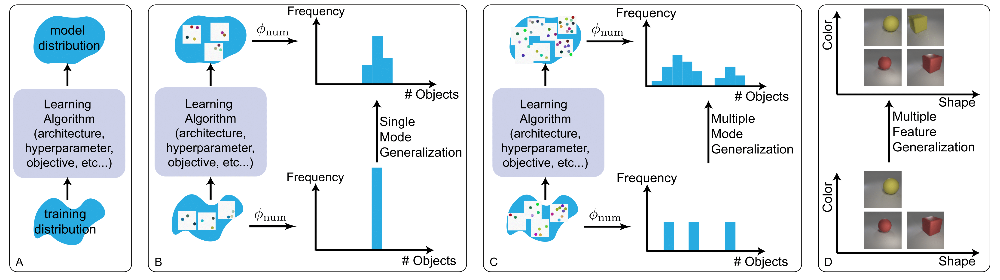

This repository contains code related to numerosity and pie experiments in the paper 
["Bias and Generalization in Deep Generative Models"](to appear). 



For code and instructions on the dataset, please refer to the 
[dataset](https://github.com/ShengjiaZhao/BiasAndGeneralization/tree/master/dataset) folder. 

To train the model, use ``` python train.py [options] ```

Important arguments are:

- ``--objective=str`` where ``str`` can be ``vae`` or ``gan``.

- ``--architecture=str`` where ``str`` can be ``conv``, ``small``, ``large`` or ``fc``. ``conv``, 
``small`` and ``large`` use a convnet, while ``fc`` uses a fully connected network. 
``small`` has ~1/2 as many parameters as ``conv`` while ``large`` has ~4 times as many parameters as ``conv``. 

- ``--dataset=str`` is the dataset we would like to train on:
    1. To train on the dots dataset, ``str=dots_a_b_...``, where ``a, b, ...`` are the number of dots that should appear in the dataset. 
For example, to train on images with 3 or 6 dots, use ``--dataset=dots_3_6``. 

    2. To train on the pie dataset ``str=pie_n_f_v`` where ``n`` is a positive integer that corresponds to the number of combinations; 
``f`` is an integer taking values in {0, 1, 2, 3} that specifies which feature we would like to fix 
(size, x-location, y-location and red-proportion);
``v`` is a sequence of integers taking values in [1, 9] that correspond to the values the fixed feature should take. 
For example ``--dataset=pie_30_0_135`` means that 
the 0-th feature (size) should only takes values in {1, 3, 5}, while all other features can take any value. 
We randomly sample 30 combinations given these constraints. 

- ``--z_dim=int`` is the dimensionality of latent variables ``z``. 

- ``--gpu=int`` specifies which GPU to launch the job.

- ``--data_path=str`` where ``str`` is the path to the folder that contains the dots dataset. 
Only needed for the dots dataset. The pie dataset is generated on the fly. 

- ``--log_path=str`` where ``str`` is the path to write all logs generated by the program. 


Example usage

``` python train.py --objective=vae --architecture=small --dataset=pie_30_0_135 --z_dim=100 --gpu=1 --log_path=log```

``` python train.py --objective=gan --architecture=conv --dataset=dots_5_10 --z_dim=100 --gpu=2 --log_path=log```
